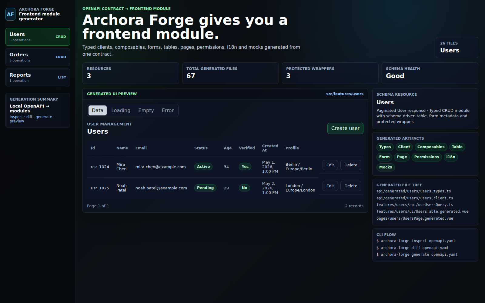

# Archora Forge

OpenAPI generators give you a client. **Archora Forge gives you a preview frontend module scaffold.**

Archora Forge is a local-first CLI for turning OpenAPI 3.x contracts into typed Vue frontend module scaffolds: API clients, query keys, composables, schema-driven form/table metadata, pages, routes, permissions, i18n and mocks.

It is built for teams evaluating generated frontend structure, not for treating generated output as production-stable application code.



[Open full-size screenshot](apps/docs/public/screenshots/forge-demo-users.png)

Expected GitHub Pages docs URL after Pages is enabled: https://akotofff.github.io/Archora-forge/

## Why It Exists

Most OpenAPI generators stop at the transport layer. That still leaves frontend teams to wire query hooks, resource folders, list pages, forms, empty states, permissions, mock data and regeneration rules by hand.

Archora Forge starts from the same OpenAPI contract and generates the module shape around the client:

```txt
Before
  openapi.yaml

After
  src/shared/api/generated/
  src/features/users/
  src/features/orders/
  src/features/reports/
  src/pages/users/
  src/pages/orders/
  src/pages/reports/
```

Generated output is designed to be inspected, committed and regenerated safely.

## Quick Start

Monorepo public-preview flow:

```bash
pnpm install
pnpm build

node packages/cli/dist/index.js inspect examples/vue-admin/openapi.yaml
node packages/cli/dist/index.js diff examples/vue-admin/openapi.yaml
cd examples/vue-admin
node ../../packages/cli/dist/index.js generate openapi.yaml --dry-run
pnpm dev
```

For a clean external consumer smoke:

```bash
./scripts/smoke-external-consumer.sh
```

The smoke packs the CLI, installs it into `/tmp/archora-forge-consumer`, runs the installed `archora-forge` binary and verifies generated files.

## Preview Package Usage

Archora Forge is still a preview/devtool package. Do not treat the package API or generated output as production-stable yet.

Local preview check:

```bash
pnpm pack:check
./scripts/smoke-external-consumer.sh
```

Consumer install from a packed tarball:

```bash
pnpm --dir packages/cli pack --pack-destination /tmp/archora-forge-pack
pnpm add /tmp/archora-forge-pack/archora-forge-cli-*.tgz
pnpm exec archora-forge inspect ./openapi.yaml
```

No npm publish is part of the default workflow. Run `pnpm release:check`, inspect tarball contents and cut a preview tag only after explicit release approval.

## Installed CLI Flow

```bash
archora-forge init
archora-forge inspect ./openapi.yaml
archora-forge diff ./openapi.yaml
archora-forge generate ./openapi.yaml
```

## CLI

```bash
archora-forge init
archora-forge inspect ./openapi.yaml
archora-forge validate ./openapi.yaml
archora-forge diff ./openapi.yaml
archora-forge lint ./openapi.yaml
archora-forge contract-diff ./old-openapi.yaml ./new-openapi.yaml
archora-forge generate ./openapi.yaml
```

During local monorepo development, use:

```bash
node packages/cli/dist/index.js inspect examples/vue-admin/openapi.yaml
```

## What Gets Generated

For each detected resource, Archora Forge can create:

- schema-derived TypeScript types;
- typed API client methods;
- typed query keys;
- Vue composables for list/detail/create/update/delete operations;
- schema-driven forms;
- schema-driven tables;
- generated pages and routes;
- permissions metadata;
- i18n labels;
- mock fixtures, handlers and scenarios;
- a local Archora UI fallback adapter.

Example tree:

```txt
src/
  shared/
    api/generated/users/
      users.types.ts
      users.client.ts
      users.query-keys.ts
      index.ts
    mocks/users/
      users.fixtures.ts
      users.handlers.ts
      users.scenarios.ts
      index.ts
    ui/
      archora-ui.ts
  features/users/
    api/
      useUsersQuery.ts
      useUserQuery.ts
      useCreateUserMutation.ts
      useUpdateUserMutation.ts
      useDeleteUserMutation.ts
    model/
      users.config.ts
      users.permissions.ts
      users.i18n.ts
    ui/
      UsersTable.generated.vue
      UsersTable.vue
      UserForm.generated.vue
      UserDrawer.generated.vue
      DeleteUserConfirm.generated.vue
  pages/users/
    UsersPage.generated.vue
    users.routes.ts
    index.ts
```

## Schema-driven UI

Forms and tables are derived from schema metadata:

- required fields become required form metadata;
- enum fields become select options and badge columns;
- `format: email`, `date` and `date-time` map to appropriate controls/cell formatting;
- nullable, read-only and write-only fields influence generated create/edit/table output;
- paginated list responses become pagination metadata for generated table scaffolds.

## Type-safe Generation

Generated clients and composables use schema-derived request, response, path and query types. Entity models exclude response-only/write-only mismatches where possible, while create/update DTOs preserve request fields when the OpenAPI contract provides DTO schemas.

## Regeneration Safety

Generated files use `.generated.*` naming where appropriate. Custom wrappers, such as `features/users/ui/UsersTable.vue`, are protected by default so teams can regenerate from OpenAPI without overwriting hand-written integration code.

Use `diff` before `generate` to see what would be created, updated or protected.

## Local-first and Enterprise-friendly

Archora Forge runs in your repository. API contracts do not need to be uploaded to a SaaS service. Generated output is plain TypeScript/Vue code that can be reviewed in pull requests and adapted behind wrapper files, but the preview generator output is not a stable public API.

The generated fallback `src/shared/ui/archora-ui.ts` keeps demos and consumers working without a UI package. Teams using the real `@archora/ui` can replace that adapter file with re-exports from the package.

## Demo App

The Vue example in `examples/vue-admin` shows generated Users, Orders and Reports modules in one dark-first screenshot-friendly shell with generated artifacts, file output and CLI flow context:

```bash
pnpm --filter vue-admin dev
```

## Roadmap

Public preview scope stays focused on local OpenAPI-to-Vue module scaffolding. Next areas:

- deeper OpenAPI composition modeling;
- richer transport customization;
- real `@archora/ui` package integration path;
- broader fixture coverage;
- broader remote schema and CI-oriented workflows;
- broader generated-app proof for experimental TanStack/Zod modes;
- additional framework adapters later.

## Current Preview Limitations

- Vue 3 and TypeScript are the current target.
- OpenAPI `oneOf`, `anyOf` and complex `allOf` are not deeply modeled yet.
- Simple object `allOf` can be merged when branches are safe; polymorphic composition is diagnostic-only.
- Transport behavior is intentionally small; bearer/api-key header presets exist, but OAuth refresh, retries and typed error envelopes are future work.
- TanStack Vue Query and Zod generation are experimental opt-in modes with isolated generated TypeScript proof, not full app integration.
- Multi-schema, Nuxt and plugin APIs are experimental foundations, not ready feature claims.
- The Archora UI integration has a fallback adapter and an experimental opt-in real `@archora/ui` import mode.
- React is on the roadmap later, not in the current MVP.

## Development Verification

```bash
pnpm test
pnpm lint
pnpm typecheck
pnpm build
pnpm --filter docs build
pnpm --filter vue-admin typecheck
pnpm --filter vue-admin build
./scripts/smoke-external-consumer.sh
```
